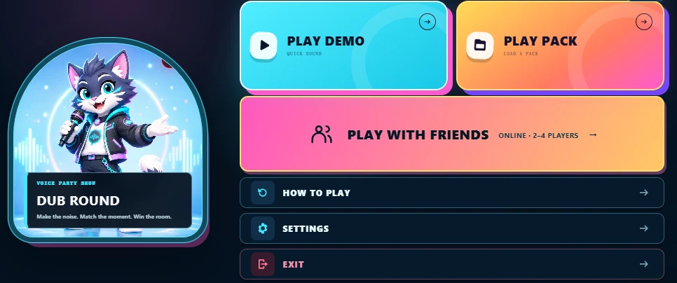
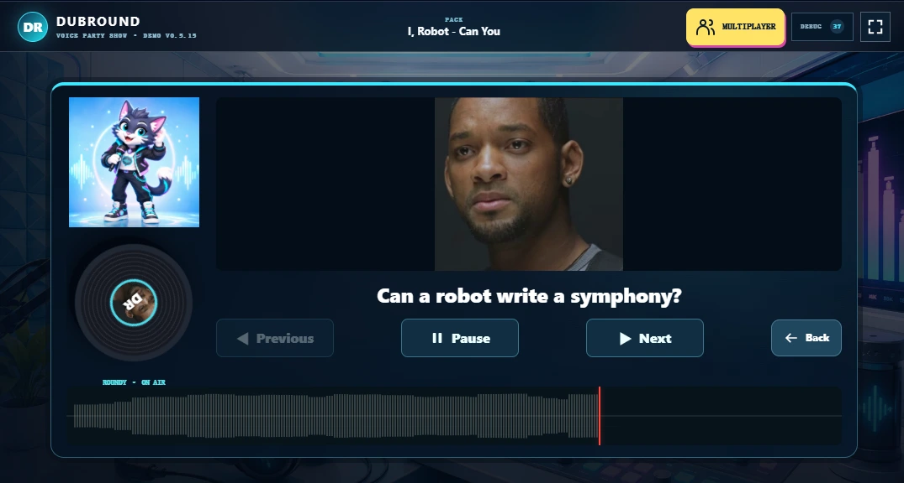
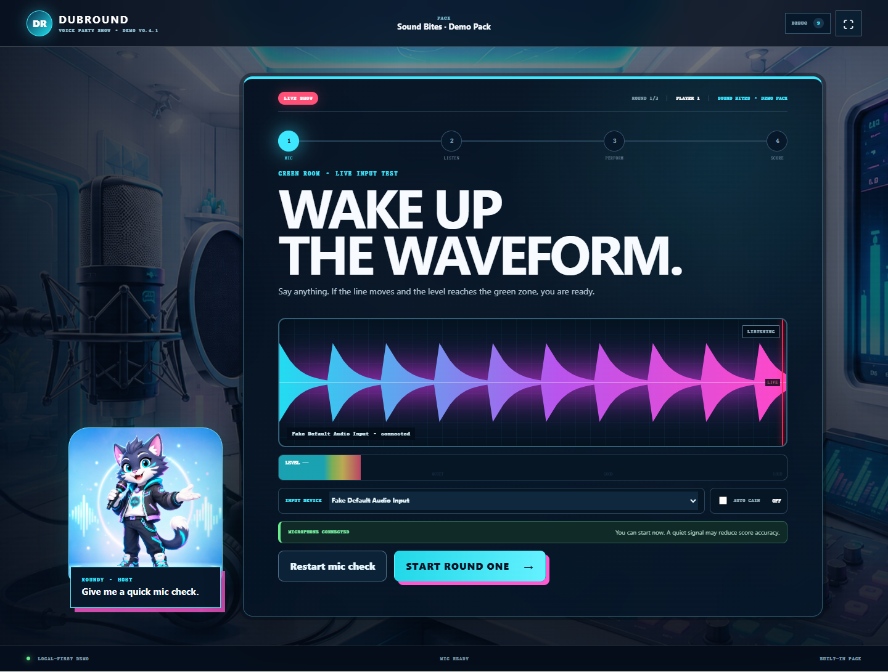

# DubRound — 让每一句台词成为你的声音挑战


**官方网站：[dubround.com](https://dubround.com/)** · [开始游戏](https://dubround.com/games/dub-round/) · [社区 Packs](https://dubround.com/packs/community/) · [制作 Pack](https://dubround.com/create/from-video/)

DubRound 是一个在浏览器中聆听、配音和比较表现的声音游戏平台。选一段熟悉的台词，打开麦克风，演出自己的版本：独自练习，或和朋友轮流挑战。

## 一段台词，多种玩法



- **即时配音**：聆听、录音、回放，比较节奏等声音表现。评分用于娱乐，不验证身份或台词准确性。
- **朋友同场挑战**：共享设备的本地派对；在线房间支持 2–4 人轮流、同一 Pack 校验及分数同步，需要独立房间服务可用。
- **社区素材库**：浏览有来源标注的 Pack，下载支持的资源并加载游戏，查看真实下载与处理状态。上游资源可能变更或下架。
- **自定义视频 Pack**：把自己有权使用的视频切成语音片段，预览并导出可重复游玩的 ZIP。
- **保留表演**：基础录音和评分在本机处理，支持保存与导出；浏览器数据仍需自行备份。

## 从聆听到你的版本



1. 选择示例、社区 Pack 或导入自己的素材。
2. 授权麦克风，说一句话确认有声音。
3. 聆听参考片段，按自己的风格完成录音。
4. 比较表现、重试，或把麦克风交给下一位。



在线房间同步玩家、轮次及分数，不是实时语音通话，也不自动分发私人 Pack 音频。

## 探索 dubround.com

| 想做什么 | 页面 |
| --- | --- |
| 玩配音游戏 | [DubRound](https://dubround.com/games/dub-round/) |
| 和朋友挑战 | [多人玩法](https://dubround.com/multiplayer/) |
| 寻找素材 | [社区 Packs](https://dubround.com/packs/community/) |
| 视频变成游戏 | [Pack 制作器](https://dubround.com/create/from-video/) |
| 排查设备 | [麦克风测试](https://dubround.com/tools/mic-test/) |
| 了解使用规则 | [条款](https://dubround.com/terms/) · [隐私](https://dubround.com/privacy/) |

## 本地开发与静态发布

技术栈：Next.js、React、TypeScript、浏览器音频 API、Workbox。GitHub 发布仓库保存 **out 静态产物**，不是可直接运行 npm 的源码仓库。

以下命令在本地源码项目执行：

```bash
npm run dev
npm run typecheck
npm run build-preserve-git
```

构建在项目内的隔离目录完成，成功后才更新 out。已有 out/.git 和所有 README 变体保持原样；首次构建从源码 README 创建发布说明并修正图片相对路径。首次初始化远程地址为 https://github.com/mooyu-king/dubround.git，不自动提交、推送或覆盖已有 origin。

发布流程：本地构建 → 审查 out 差异 → 手动提交静态仓库 → Cloudflare Pages 发布。静态仓库已编译，不需要在 Cloudflare 再运行 Next 构建。保留根目录 _headers，以应用同源嵌入限制；正式域名为 **dubround.com**。

**服务边界**：out 不包含运行中的房间服务或 Pack 下载代理，必须另行部署并配置验证。构建成功不代表线上多人、远程下载已可用。不要上传 .env、服务密钥、源码依赖或隔离构建目录。

网站使用 data.1back.link 流量统计，详情见隐私说明。麦克风需要 HTTPS 或本地开发环境及用户授权。

## 版权与联系

DubRound 原创代码、界面和品牌不因公开访问而授予转载许可。第三方游戏、Pack、图片及音频归各自权利人所有；可下载不等于可重新发布。制作器仅用于自己制作、获许可或依法可使用的素材。公开浏览器资源无法保证完全不可下载。

联系：[mooyuking@gmail.com](mailto:mooyuking@gmail.com) · [dubround.com/contact](https://dubround.com/contact/)
